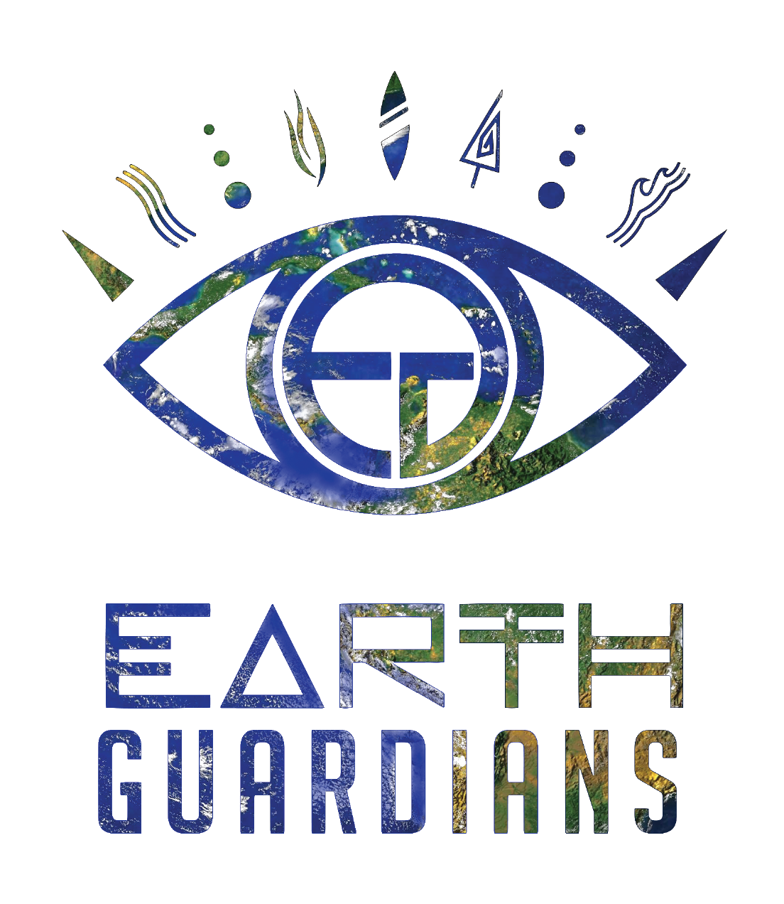

# 🌎 EG-Maps — Map of Guardianship



**"Acting locally for global impact"**

An interactive mapping platform that visualizes endangered species and their ecosystems to spotlight wildlife on the brink of extinction. Built with **Nuxt 3**, **Vue 3**, **MapLibre GL**, and **TypeScript**.

**[Explore the Map](https://earthguardians.org/maps)** | [Share Your Story](mailto:crews@earthguardians.org) | [Report an Issue](https://github.com/earthguardians/eg-maps/issues)

---

## 📋 Table of Contents

- [About the Project](#-about-the-project)
- [The Mission](#-the-mission)
- [Features](#-features)
- [How to Contribute](#-how-to-contribute)
- [Tech Stack](#-tech-stack)
- [Getting Started](#-getting-started)
- [Project Structure](#-project-structure)
- [Data Visualization](#-data-visualization)
- [Internationalization](#-internationalization)
- [Testing](#-testing)
- [Deployment](#-deployment)
- [Contributing](#-contributing)
- [License](#-license)

---

## 🌱 About the Project

This platform emerged from Earth Guardians' mission to create a **truly inclusive, decentralized conservation tool**. While top-down scientific databases often miss the full story, we believe local knowledge and frontline context are essential for understanding and protecting biodiversity.

The Map of Guardianship brings together:

- **Endangered Species** — Critically endangered wildlife and their habitats worldwide
- **Project Grants** — Earth Guardians' grassroots initiatives supporting communities on the ground

This is not just a data visualization tool — it's a living platform for **global solidarity** where Crews and communities share their stories of local action.

---

## 🌍 The Mission

> *"True conservation outcomes are driven by youth, local communities, and grassroots action on the ground."*

### Why This Platform Exists

1. **Ground global crises into reality** — Move beyond abstract statistics to see species and ecosystems on interactive maps
2. **Amplify local voices** — Feature stories from Crews and communities defending wildlife in their regions
3. **Build global solidarity** — Connect conservation efforts across continents through shared data and narratives
4. **Turn data into action** — Move past simple awareness to create tools for real-world impact

### Who It's For

- **Earth Guardians Crews** — Share your local conservation work and see it featured on the global map
- **Researchers & Conservationists** — Access species data and visualize ecosystems under threat
- **Educators & Activists** — Use the platform to teach and inspire action
- **Anyone who cares** — Explore, learn, and join the movement

---

## ✨ Features

### Visualization Modes
- **2D Map View** — Interactive MapLibre GL map with satellite imagery
- **3D Globe View** — WebGL-powered 3D Earth visualization

### Interactive Elements
- **Smart Markers** — Color-coded markers with clustering for dense areas
- **Connection Lines** — Visual links between related locations
- **Hex Grid Overlay** — Optional hexagonal grid for regional analysis
- **Animated Particles** — Dynamic particle effects on connection lines
- **Search & Filters** — Real-time filtering by region, ecosystem, threat type

### User Experience
- **Responsive Design** — Optimized for desktop, tablet, and mobile
- **Dark/Light Mode** — User-toggleable theme with system preference detection
- **Multi-language Support** — English, Spanish, French, Portuguese
- **Keyboard Navigation** — Full keyboard accessibility (Ctrl+K for search)
- **Fullscreen Mode** — Immersive map viewing experience

---

## 🛠 Tech Stack

| Technology | Purpose | Version |
|------------|---------|---------|
| **Nuxt 3** | Full-stack Vue framework | ^3.21.6 |
| **Vue 3** | UI framework with Composition API | ^3.5.34 |
| **TypeScript** | Type-safe JavaScript | ^6.0.3 |
| **MapLibre GL** | Open-source map rendering | ^5.24.0 |
| **Tailwind CSS** | Utility-first styling | ^3.4.19 |
| **MapTiler** | Satellite tile provider | — |
| **ESLint** | Code linting | ^1.15.2 |
| **Vitest** | Unit testing | ^4.1.7 |
| **Playwright** | E2E testing | ^1.60.0 |
| **pnpm** | Package manager | ^10.12.0 |

---

## 🚀 Getting Started

### Prerequisites

- **Node.js** 18+ (LTS recommended)
- **pnpm** 8+ (or npm/yarn as fallback)
- **MapTiler API Key** (free tier available)

### Installation

```bash
# Clone the repository
git clone https://github.com/earthguardians/eg-maps.git
cd eg-maps

# Install dependencies
pnpm install

# Copy environment variables
cp .env.example .env
```

### Environment Configuration

Create a `.env` file in the project root:

```env
# MapTiler API Key (required for map tiles)
NUXT_PUBLIC_MAPTILER_API_KEY=your_maptiler_api_key

# Base URL (for GitHub Pages deployment)
NUXT_APP_BASE_URL=/
```

Get your free MapTiler API key at [maptiler.com](https://www.maptiler.com/).

### Development

```bash
# Start development server with hot reload
pnpm dev

# Build for production
pnpm build

# Generate static site
pnpm generate

# Preview production build
pnpm preview

# Run linter
pnpm lint

# Run tests
pnpm test
```

The development server will start at `http://localhost:3000`.

---

## 📁 Project Structure

```
EG-Maps/
├── components/              # Vue components
│   ├── ui/                  # Reusable UI primitives
│   │   ├── Icon.vue         # Icon wrapper component
│   │   └── LoadingSpinner.vue
│   ├── GlobalStats.vue      # Statistics panel
│   ├── GlobeView.vue        # 3D globe visualization
│   ├── MapControls.vue      # Search, filters, controls
│   ├── ProjectFilterPanel.vue
│   ├── RedBookDatabases.vue
│   ├── SpeciesFilterPanel.vue
│   └── UnifiedMap.vue       # 2D map visualization
├── composables/             # Vue composables (reusable logic)
│   ├── useDarkMode.ts       # Theme management
│   ├── useI18n.ts           # Translations
│   ├── useMapCluster.ts     # Marker clustering
│   ├── useMapConnections.ts # Connection lines
│   ├── useMapHexGrid.ts     # Hex grid overlay
│   ├── useMapLibre.ts       # MapLibre integration
│   ├── useMapMarkers.ts     # Marker management
│   ├── useMapPopup.ts       # Popup handling
│   ├── useSpeciesData.ts    # Species data fetching
│   └── useSpeciesIcons.ts   # Species icon mapping
├── lib/                      # Utility modules
│   ├── types.ts             # TypeScript interfaces
│   ├── constants.ts         # Route paths, constants
│   ├── colors.ts            # Color utilities
│   ├── utils.ts             # Helper functions
│   ├── project-data.ts      # Project grants data
│   ├── map-utils.ts         # Map utilities
│   ├── map-effects.ts       # Visual effects
│   └── image-utils.ts       # Image handling
├── locales/                  # i18n translation files
│   ├── en.json              # English
│   ├── es.json              # Spanish
│   ├── fr.json              # French
│   └── pt.json              # Portuguese
├── pages/                    # Nuxt pages (routes)
│   ├── index.vue            # Home/landing page
│   ├── globe.vue            # Globe redirect
│   ├── info.vue             # Info & feedback page
│   ├── project-grants/      # Project grants routes
│   │   ├── index.vue        # 2D map
│   │   └── 3d.vue           # 3D globe
│   └── endangered-species/  # Species routes
│       ├── index.vue        # 2D map
│       └── 3d.vue           # 3D globe
├── layouts/                  # Nuxt layouts
│   └── default.vue          # Default layout
├── plugins/                  # Nuxt plugins
│   └── iconify-icon.client.ts
├── public/
│   ├── data/                # Static species data
│   ├── eg-logo.png          # Earth Guardians logo
│   └── manifest.json        # PWA manifest
├── scripts/                  # Utility scripts
│   ├── convert-csv-to-species.py
│   ├── download-species-images.py
│   └── build-species-icon-mapping.mjs
├── tests/                    # Test files
│   ├── utils.test.ts        # Unit tests
│   └── routes.spec.ts       # E2E tests
├── assets/css/               # Global styles
├── nuxt.config.ts            # Nuxt configuration
├── tailwind.config.ts        # Tailwind configuration
├── tsconfig.json             # TypeScript configuration
└── package.json              # Dependencies & scripts
```

---

## 🗺 Data Visualization

### Map Components

#### UnifiedMap.vue
The main 2D map component that renders:
- Project grants and endangered species markers
- Connection lines between locations
- Hex grid overlay
- Animated particles
- Popup information panels
- Fullscreen mode support

#### GlobeView.vue
A 3D globe visualization with the same features as the 2D map, rendered on a WebGL sphere.

### Marker System

```typescript
// Marker types
type MarkerType = 'project' | 'species' | 'unified'

// Marker creation
createUnifiedMarkerElement()   // Combined project/species markers
createProjectMarkerElement()   // Project-specific markers
createSpeciesMarkerElement()   // Species-specific markers
```

### Layers

| Layer | Type | Description |
|-------|------|-------------|
| Background | Raster | MapTiler satellite tiles |
| Markers | Symbol | Point markers with icons |
| Connections | Line | Connection lines between points |
| Particles | Canvas | Animated particles on connections |
| Hex Grid | Canvas | Hexagonal grid overlay |

### Data Sources

**Project Grants:**
- Source: `lib/project-data.ts`
- Format: `ProjectData[]` with location, beneficiaries, title

**Endangered Species:**
- Source: `/public/data/species/index.json`
- Format: Hierarchical by taxonomic group

---

## 🌐 Internationalization

### Supported Languages

| Code | Language | Status |
|------|----------|--------|
| `en` | English | ✅ Complete |
| `es` | Spanish | ✅ Complete |
| `fr` | French | ✅ Complete |
| `pt` | Portuguese | ✅ Complete |

### Translation Structure

```json
{
  "nav": {
    "home": "Home",
    "projectGrants": "Project Grants"
  },
  "home": {
    "title": "Earth Guardians",
    "subtitle": "Interactive Data Visualization Platform"
  },
  "mapControls": {
    "search": "Search",
    "showFilters": "Show Filters"
  }
}
```

### Adding Translations

1. Edit `locales/en.json` with new keys
2. Copy to target locale file (es.json, fr.json, pt.json)
3. Translate values while keeping key structure
4. Access via `t('path.to.key')` in components

---

## 🧪 Testing

### Unit Tests (Vitest)

```bash
# Run all unit tests
pnpm test

# Run tests in watch mode
pnpm test:watch
```

### E2E Tests (Playwright)

```bash
# Run E2E tests
pnpm exec playwright test

# Run tests against static build
pnpm exec playwright test --config playwright.static.config.ts
```

### Test Coverage

| Type | Location | Coverage |
|------|----------|----------|
| Utility functions | `tests/utils.test.ts` | String formatting, validation |
| Route navigation | `tests/routes.spec.ts` | All main routes |

---

## 🚢 Deployment

### GitHub Pages (Static)

The project is configured for GitHub Pages deployment via static site generation:

```bash
# Build and generate static files
pnpm generate

# Output in dist/ directory
```

### Environment for Production

```env
NUXT_PUBLIC_MAPTILER_API_KEY=your_production_key
NUXT_APP_BASE_URL=/eg-maps/  # If in subdirectory
```

### Static Generation Routes

These routes are prerendered for optimal performance:

- `/` — Home page
- `/globe` — Redirect to project grants globe
- `/info` — Info & feedback page
- `/project-grants` — 2D project grants map
- `/project-grants/3d` — 3D project grants globe
- `/endangered-species` — 2D species map
- `/endangered-species/3d` — 3D species globe

---

## 🤝 How to Contribute

**Your local knowledge matters.** Top-down scientific databases often miss critical context that communities possess.

### Share Your Story

If you're part of an Earth Guardians Crew or community working to protect endangered species:

1. **Explore the map** — Are there endangered species near you that you recognize?
2. **Send us your story** — Reply to [crews@earthguardians.org](mailto:crews@earthguardians.org) with:
   - Stories of how your Crew or community is defending species
   - Photos of local wildlife and conservation efforts
   - Updates on projects protecting ecosystems in your region
3. **Get featured** — Your grassroots narratives will be integrated directly into the map project

### Data Contribution

- Report missing species in your region
- Add local context to existing species entries
- Submit photos and first-hand observations
- Help keep red list databases up to date

---

## 📄 License

This project is part of Earth Guardians' open-source initiative to create tools for global conservation. See [LICENSE](LICENSE) for details.

---

## 🙏 Acknowledgments

- **Earth Guardians Crews** — For sharing local knowledge and frontline conservation stories
- **MapTiler** — Free tile services for development
- **MapLibre GL** — Open-source map rendering
- **Wikimedia Commons** — Species images
- **IUCN Red List** — Endangered species conservation data
- **Lucide Icons** — Icon library

---

## 💻 For Developers

We also welcome code contributions! If you're a developer interested in improving the platform:

1. **Fork** the repository
2. **Clone** your fork locally
3. **Create a branch** for your feature: `git checkout -b feature/my-feature`
4. **Make changes** and commit with descriptive messages
5. **Push** to your fork
6. **Open a Pull Request** with a clear description

### Code Standards

- Use TypeScript strict mode
- Follow Vue 3 Composition API patterns
- Use Tailwind CSS utilities over custom CSS
- Add proper ARIA labels for accessibility
- Write tests for new functionality

### Commit Convention

```
feat: add new filter option
fix: resolve popup positioning issue
docs: update README
style: improve responsive layout
refactor: extract marker logic to composable
```

---

## 📞 Contact & Support

| Channel | Details |
|---------|---------|
| 🌐 **Website** | [earthguardians.org](https://earthguardians.org) |
| 📧 **Crews Email** | [crews@earthguardians.org](mailto:crews@earthguardians.org) |
| 🐛 **Issues** | [Report a bug](https://github.com/earthguardians/eg-maps/issues) |

---

<p align="center">
  <strong>Rising together.</strong><br>
  Built with 💚 by Earth Guardians and the global Crew network.
</p>